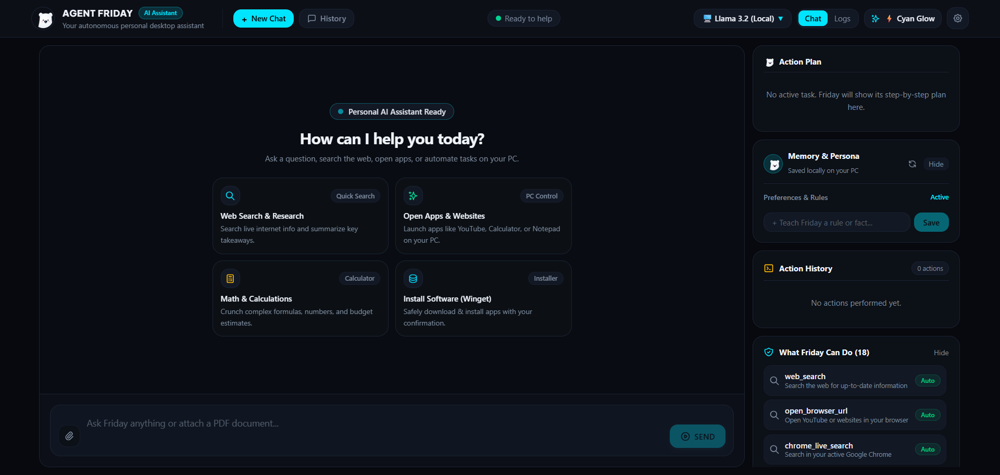
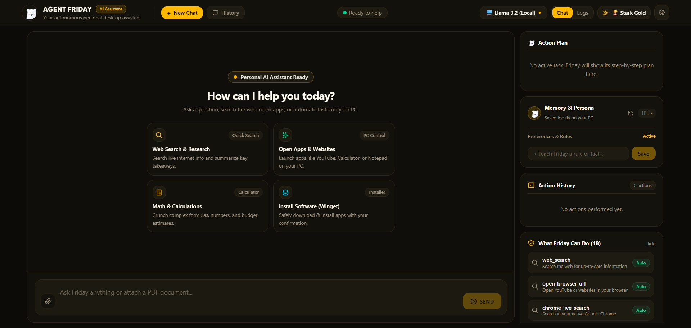
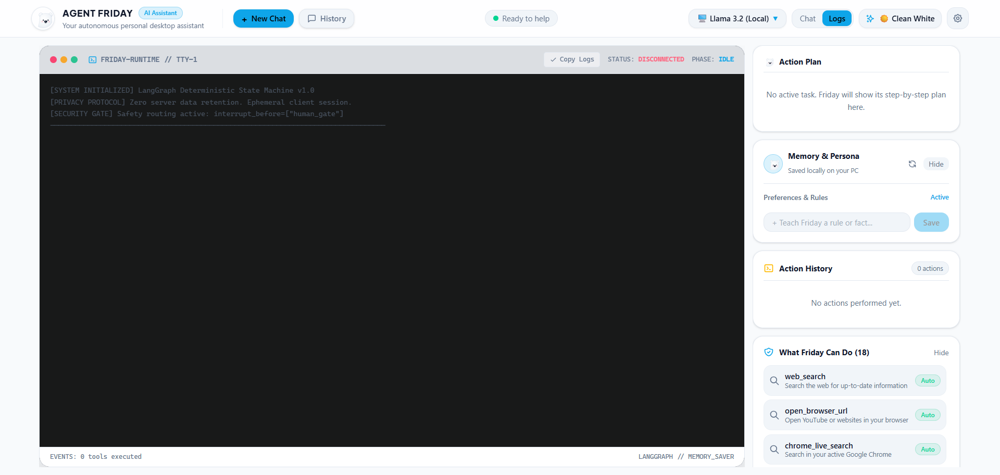
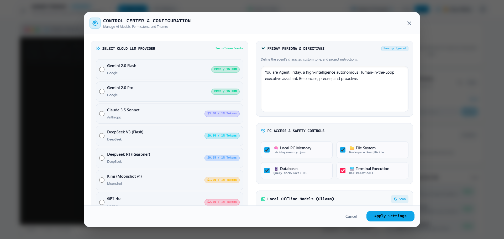
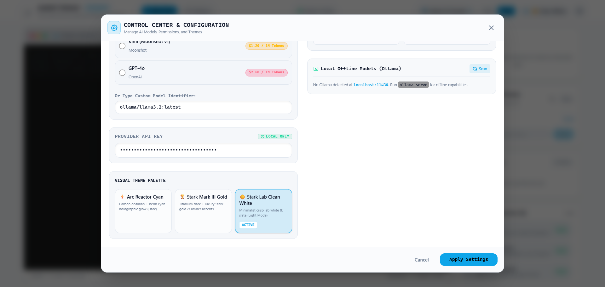
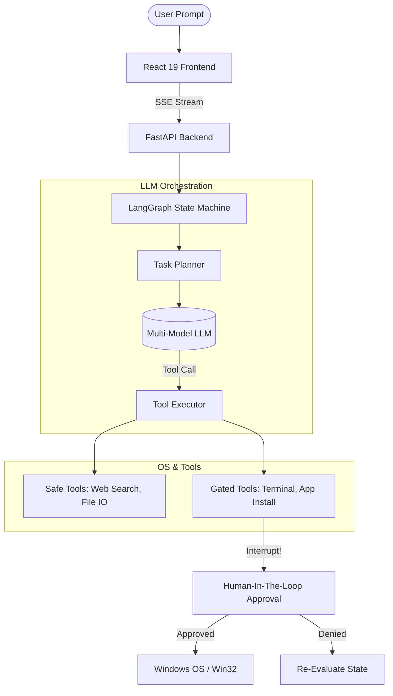

<div align="center">
  
  
  <h1>🤖 Agent Friday</h1>
  <p><strong>An Autonomous, OS-Level Desktop Assistant Powered by LangGraph & React</strong></p>

  <p>
    
    
    
    
    
  </p>

  <p>
    <em>Bridging the gap between LLM reasoning and real-world OS execution with strict Human-in-the-Loop (HITL) security.</em>
  </p>
</div>

---

## 📖 Executive Summary

**Agent Friday** is an enterprise-grade, locally deployed autonomous desktop assistant. Unlike standard chat wrappers, Friday is engineered to physically interact with the Windows OS. It can autonomously search the web, manage software via `winget`, execute terminal commands, and extract data from local files. 

To achieve maximum reliability and safety, it relies on a **stateful LangGraph orchestrator** on the backend and a **3-Tier Human-in-the-Loop Security Model** on the frontend—all wrapped in a stunning, high-performance glassmorphic React interface.

---

## 🖼️ UI & Features Showcase

<p align="center">
  
  
</p>
<p align="center">
  
  
</p>
<p align="center">
  
  
</p>
<p align="center">
  
</p>

---

## 🏗️ System Architecture

The architecture is strictly decoupled, using an event-driven loop to stream LLM reasoning nodes to the client in real-time.



---

## 🛠️ Tech Stack & Engineering Highlights

| Layer | Technologies Used | Key Implementation Details |
| :--- | :--- | :--- |
| **Frontend** | React 19, TypeScript, Vite, Tailwind CSS | Implements a **Glassmorphic Stark-HUD** design system. Uses raw CSS tokens and `backdrop-blur` for a premium, native-app feel. |
| **Backend** | Python 3.11+, FastAPI, SQLite | High-performance async API. Uses `subprocess.Popen` for **non-blocking OS interactions**, ensuring the event loop never stalls during browser launches. |
| **AI / NLP** | LangGraph, LangChain | Persistent agent memory (`.db` checkpoints). Agnostic LLM support (Gemini, Claude, DeepSeek, OpenAI) with **Ollama Auto-Discovery** for 100% offline usage. |
| **System** | Win32 API, PowerShell, Regex | Features a robust **Regex Hallucination Guard** to sanitize LLM markdown artifacts (e.g., `<https://...>` or `https//`) before executing OS-level shell commands. |

---

## 🛡️ Enterprise-Grade Security (HITL)

Giving an LLM terminal access is inherently dangerous. Agent Friday solves this via a **3-Tier Autonomy Engine**:

1. 🟢 **Strict (Safe Mode):** Read-only. Web search, file reading, and math logic are permitted. System modifications are hard-blocked at the routing layer.
2. 🟡 **Medium (Developer):** Permits standard file writing and localized terminal commands. Software installation (`winget`) remains blocked.
3. 🔴 **Full (God Mode):** Complete autonomous execution.

> **The Approval Gate:** Any high-risk OS action triggers a LangGraph interrupt. The React frontend intercepts this state and renders a centralized **Glassmorphic Execution Payload Modal**, requiring explicit cryptographic-style approval from the user before the command touches the OS shell.

---

## 🚀 Instant Deployment (1-Click)

The repository includes a robust PowerShell deployment script that automatically provisions a Python virtual environment, installs backend dependencies, and registers a global Windows command wrapper.

Run this in an Administrator PowerShell to deploy globally:
```powershell
irm https://raw.githubusercontent.com/friday-ai/agent-friday/main/install.ps1 | iex
```
*(After installation, simply type `friday` in any terminal to launch the HUD.)*

### Manual Developer Setup
```bash
# 1. Backend (FastAPI)
python -m venv .venv
.\.venv\Scripts\activate
pip install -e backend
uvicorn backend.api.main:app --reload --port 8000

# 2. Frontend (React)
cd frontend
npm install
npm run dev
```

---

## 🤝 Let's Connect
> **Built for recruiters and engineering leaders:** This project demonstrates full-stack ownership, advanced AI agent orchestration, secure systems engineering, and an obsession with pixel-perfect UI/UX design.

If you are looking for an engineer who builds robust, product-minded AI systems from the ground up, let's talk.
